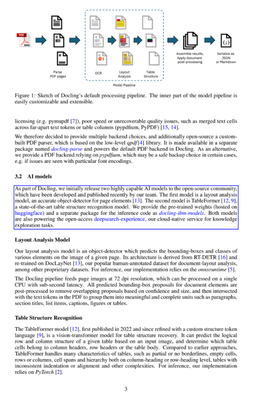
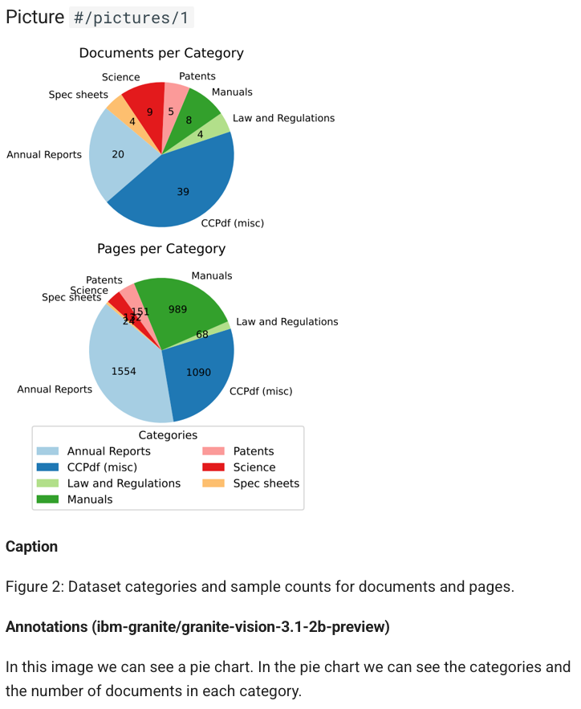

# Examples

I was trying to learn Docling and found that the examples page was basically empty - it just said "use navigation to browse examples" which wasn't helpful at all. So I organized all the existing examples and added descriptions to make them actually useful.

Here are some quick highlights to get you started:

- 🔀 conversion examples ranging from [simple conversion to Markdown](./minimal.py) and export of [figures](./export_figures.py) & [tables](./export_tables.py), to [VLM](./minimal_vlm_pipeline.py) and [audio](./minimal_asr_pipeline.py) pipelines
- 💬 various RAG examples, e.g. based on [LangChain](./rag_langchain.ipynb), [LlamaIndex](./rag_llamaindex.ipynb), or [Haystack](./rag_haystack.ipynb), including [visual grounding](./visual_grounding.ipynb), and using different vector stores like [Milvus](./rag_milvus.ipynb), [Weaviate](./rag_weaviate.ipynb), or [Qdrant](./retrieval_qdrant.ipynb)
- 📤 [{==\[:fontawesome-solid-flask:{ title="beta feature" } beta\]==} structured data extraction](./extraction.ipynb)
- examples for ✍️ [serialization](./serialization.ipynb) and ✂️ [chunking](./hybrid_chunking.ipynb), including [user-defined customizations](./advanced_chunking_and_serialization.ipynb)
- 🖼️ [picture annotations](./pictures_description.ipynb) and [enrichments](./enrich_doclingdocument.py)

## Quick Start Examples

### Basic Usage
- **[Minimal Usage](minimal.py)** - Basic document conversion with minimal configuration
- **[CLI Examples](run_md.py)** - Command-line interface usage patterns
- **[Format Handling](run_with_formats.py)** - Working with different input and output formats
- **[Accelerator Support](run_with_accelerator.py)** - Using GPU/MLX acceleration

### Document Processing
- **[Custom Conversion](custom_convert.py)** - Tailored document processing pipelines
- **[Batch Processing](batch_convert.py)** - Handle multiple files efficiently
- **[Serialization](serialization.ipynb)** - Save and restore documents

## RAG & Search Examples

### Vector Databases
- **[Qdrant Integration](retrieval_qdrant.ipynb)** - Store and query documents with Qdrant
- **[Milvus Integration](rag_milvus.ipynb)** - Vector search with Milvus
- **[Weaviate Integration](rag_weaviate.ipynb)** - Document storage with Weaviate
- **[Azure Search](rag_azuresearch.ipynb)** - Cloud-based search with Azure

### AI Framework Integrations
- **[LangChain Integration](rag_langchain.ipynb)** - Build RAG applications with LangChain
- **[LlamaIndex Integration](rag_llamaindex.ipynb)** - Advanced search and retrieval
- **[Haystack Integration](rag_haystack.ipynb)** - End-to-end RAG with Haystack

## Visual & Multimodal Examples

### Visual Language Models
- **[VLM Pipeline API](vlm_pipeline_api_model.py)** - Using vision models for document understanding
- **[Minimal VLM Pipeline](minimal_vlm_pipeline.py)** - Basic VLM setup and usage
- **[Compare VLM Models](compare_vlm_models.py)** - Evaluate different vision models
- **[Visual Grounding](visual_grounding.ipynb)** - Advanced visual understanding
  

### Image Processing
- **[Picture Description](pictures_description.ipynb)** - Extract text and descriptions from images
  
- **[Picture Description API](pictures_description_api.py)** - Using external APIs for image analysis
- **[Inspect Picture Content](inspect_picture_content.py)** - Analyze image content and structure
- **[Export Figures](export_figures.py)** - Extract and process figures from documents

## Data Extraction & Processing

### Tables & Structured Data
- **[Export Tables](export_tables.py)** - Extract tables with formatting and structure
- **[Table Extraction](develop_formula_understanding.py)** - Advanced table understanding
- **[Backend CSV](backend_csv.ipynb)** - Working with CSV data sources

### Content Analysis
- **[Formula Understanding](develop_formula_understanding.py)** - Mathematical formula recognition
- **[Picture Enrichment](develop_picture_enrichment.py)** - Enhance image content with metadata
- **[Hybrid Chunking](hybrid_chunking.ipynb)** - Intelligent document segmentation
- **[Advanced Chunking](advanced_chunking_and_serialization.ipynb)** - Complex document processing

## Audio & Speech Examples

### Speech Recognition
- **[Minimal ASR Pipeline](minimal_asr_pipeline.py)** - Basic audio processing setup
- **[ASR Pipeline](test_asr_pipeline.py)** - Complete audio-to-text workflows
- **[RapidOCR Custom Models](rapidocr_with_custom_models.py)** - Custom OCR model integration

## Advanced & Custom Examples

### Pipeline Customization
- **[Full Page OCR](full_page_ocr.py)** - Complete OCR processing workflows
- **[Tesseract Language Detection](tesseract_lang_detection.py)** - Multi-language OCR support
- **[Translation Support](translate.py)** - Document translation capabilities

### Backend Integrations
- **[Backend XML RAG](backend_xml_rag.ipynb)** - XML document processing
- **[Backend PPTX](test_backend_pptx.py)** - PowerPoint document handling
- **[Backend HTML](test_backend_html.py)** - HTML document processing
- **[Backend Markdown](test_backend_markdown.py)** - Markdown document support

## Learning Paths

I've organized these examples into learning paths so you can start simple and work your way up:

### Beginner Path
1. Start with [Minimal Usage](minimal.py) - just convert a document
2. Try [CLI Examples](run_md.py) - use Docling from command line
3. Explore [Format Handling](run_with_formats.py) - work with different file types

### Intermediate Path
1. Learn [Custom Conversion](custom_convert.py) - customize the pipeline
2. Understand [Serialization](serialization.ipynb) - save and load documents
3. Explore [RAG Integrations](rag_langchain.ipynb) - build search applications

### Advanced Path
1. Master [VLM Pipelines](vlm_pipeline_api_model.py) - use vision models
2. Customize [Advanced Chunking](advanced_chunking_and_serialization.ipynb) - complex processing
3. Build [Custom Backends](custom_convert.py) - extend Docling

## Getting Help

If you get stuck:
- Check the [main docs](../index.md) for explanations
- Report bugs on [GitHub](https://github.com/docling-project/docling/issues)
- Ask questions in [GitHub Discussions](https://github.com/docling-project/docling/discussions)

## What's Next?

Now that you can actually find examples, try:
- **[Usage Guide](../usage/)** - Learn about advanced features
- **[Concepts](../concepts/)** - Understand how Docling works
- **[Integrations](../integrations/)** - Connect with other tools
- **[API Reference](../reference/)** - Technical details

    

        Visual grounding
        

        
    

    

        Picture annotations
        

        
    

