# 민감정보 분류/마스킹 가이드 (Guardrail 연동, #315)

문서 안의 민감정보(주민번호·연락처 같은 정형 PII, 부동산·인사정보 등)를 **GenOS 가드레일
워크플로우** 에 위임해 판별하고, 그 결과를 청크 메타(`content_category`) 라벨과 (옵션) 마스킹 치환으로
반영하는 기능의 통합 가이드입니다.

- **1~2절**: 전처리기를 쓰는 쪽(호출 방법, on/off 스위치, config 설정)
- **3~4절**: 워크플로우를 준비하는 쪽(GenOS — 입출력 형태, 배포)
- 카테고리 정의·프롬프트·정규식 필터는 모두 **GenOS의 워크플로우에서 설정**되며, 전처리기는 워크플로우 응답을 반영만 합니다.

---

## 0. 전체 그림

```
① 문서 업로드 (요청에 guardrail_call: true)
② 전처리기: 청킹 전에, 파싱한 문서의 텍스트를 GenOS 워크플로우로 보냄 (문서당 1번 호출)
③ 워크플로우: 민감정보를 찾아낸 후, 전처리기에 전달
   a. 정규식으로 잡히는 것(주민번호·전화·이메일 등)   → 가드레일 인스턴스가 탐지
   b. 의미로 판단해야 하는 것(부동산·인사정보 등)     → LLM이 탐지
   → "어떤 문장이 / 어떤 카테고리인지 / 마스킹하면 어떻게 되는지" 등의 정보를 response로 전달
④ 전처리기: 청킹 후, response 속 문장을 각 청크에서 찾아서
   - 그 청크에 카테고리 라벨(content_category)을 붙이고                  [항상]
   - 마스킹 스위치(masking_enabled)가 켜져 있으면, 본문도 마스킹본으로 교체   [옵션]
⑤ 라벨/마스킹이 반영된 청크가 벡터로 적재됨
```

(호출 주소·요청/응답 형식 같은 상세는 2절 참고)

GenOS에 직접 구성해야할것은 **'③ 워크플로우' 하나** 입니다. 나머지(호출·매칭·부착)는 전처리기가 합니다.

---

## 1. 전처리기에서의 사용법 — 호출과 스위치

### 1.1 켜고 끄기: 요청 kwargs `guardrail_call`

- 기능 on/off 는 config(yaml)가 아니라 **문서 업로드 요청의 kwargs** 로, 문서 건별로 제어합니다.
- 전처리기 `__call__(request, file_path, **kwargs)`의 kwargs 에 `guardrail_call` 을 넣으면 됩니다.

```jsonc
// 문서 업로드 요청 kwargs 예
{ "guardrail_call": true }    // 이 문서는 가드레일 분류 수행
{ }                           // 미지정(기본 false) → 가드레일을 아예 호출하지 않음
```

```python
# 코드로 직접 호출하는 경우
vectors = await processor(request, file_path, guardrail_call=True)
```

### 1.2 실제 호출시 입출력 예시

이 기능이 하는 일은 두 가지입니다.

- **라벨 부착**: "이 청크에 어떤 민감정보가 들어있는지"를 청크 메타 필드 `content_category` 에
  카테고리 문자열로 기록합니다. (본문은 안 바뀜 — 검색 시 "민감 정보 포함 청크 제외" 같은 필터링용)
- **마스킹 값으로 치환**: 본문 텍스트에서 민감한 부분을 워크플로우가 알려준 마스킹본으로 바꿔서 적재합니다.
  (예: `900101-1234567` → `[주민등록번호]`)

이를 제어하는 스위치는 2개입니다.

- **호출 스위치** `guardrail_call` (요청 kwargs): 이 문서에 대해 가드레일을 **호출할지 말지**
- **마스킹 스위치** `masking_enabled` (config yaml): 찾아낸 민감정보를 **마스킹 값으로 치환까지 할지**
  (꺼져 있어도 라벨 부착은 됨)

조합별 결과는 아래 예시(케이스 A~C)를 보면 빠릅니다.

**입력 문서(일부)**

```
계약자 홍길동 (900101-1234567)
서울 강남구 테헤란로 아파트를 5억에 매매하였다.
```

**케이스 A** — `guardrail_call: true` + `masking_enabled: true` → **라벨 + 마스킹**

```jsonc
// 적재되는 청크 (관련 필드만)
{
  "text": "계약자 홍길동 ([주민등록번호])\n[부동산 정보]",
  "content_category": ["민감 정보", "부동산 정보"]
}
```

- 정규식류(주민번호)는 해당 **단어만** 토큰으로, 의미류(부동산)는 탐지된 **문장 구간 전체** 가
  카테고리 토큰으로 치환됩니다.

**케이스 B** — `guardrail_call: true` + `masking_enabled: false` → **라벨만** (본문 원문 유지)

```jsonc
{
  "text": "계약자 홍길동 (900101-1234567)\n서울 강남구 테헤란로 아파트를 5억에 매매하였다.",
  "content_category": ["민감 정보", "부동산 정보"]
}
```

**케이스 C** — `guardrail_call` 미지정(기본 `false`) → **가드레일을 아예 호출하지 않음**

```jsonc
{
  "text": "계약자 홍길동 (900101-1234567)\n서울 강남구 테헤란로 아파트를 5억에 매매하였다.",
  "content_category": null
}
```

요약:

| guardrail_call (요청 kwargs) | masking_enabled (config) | 결과 |
|---|---|---|
| `true` | `true` | 라벨 부착 + 마스킹 치환 (케이스 A) |
| `true` | `false` | 라벨만 부착, 본문 원문 (케이스 B) |
| `false`(미지정) | 무관 | 호출 안 함 — 라벨 `null`, 본문 원문 (케이스 C) |

> **현재 워크플로우 기준 라벨 값은 3종입니다.**
>
> | 라벨 | 어떤 경우 붙나 | 탐지 주체 |
> |---|---|---|
> | `민감 정보` | 정규식으로 잡히는 정형 PII (주민번호·전화·이메일 등) | 가드레일 인스턴스(정규식 필터) |
> | `부동산 정보` | 부동산 소재지·면적·시세·매매/임대 등 | LLM (의미 판단) |
> | `인사 정보` | 특정 개인의 채용·평가·급여·직급·인사이동 등 | LLM (의미 판단) |
>
> 단, 이 목록은 전처리기에 하드코딩된 것이 아니라 **워크플로우가 돌려준 `category` 문자열을 그대로
> 저장** 한 것입니다. 워크플로우(프롬프트·카테고리 정의)를 수정하면 라벨 종류도 그에 따라 바뀝니다.

### 1.3 config: `guardrail:` 섹션 (접속 정보)

워크플로우 접속 정보는 전처리기 config yaml 의 `guardrail:` 섹션에 둡니다(환경 종속값).

```yaml
guardrail:
  # GenOS 분류 워크플로우 연동(#315). 기능 on/off 는 요청별 kwargs(guardrail_call)로 제어.
  url: "https://genos.genon.ai/api/gateway"   # gateway 베이스. 코드가 /workflow/{workflow_id}/run/v2 를 붙임
  workflow_id: 4932        # 민감정보 분류 워크플로우 ID
  api_key: "..."           # 워크플로우 호출 Bearer 인증키(AuthKeyBearer)
  timeout: 60              # 호출 타임아웃(초). 대용량 문서는 상향
  masking_enabled: false   # 마스킹 치환 on/off (1.2절 케이스 A/B). 라벨 부착은 기능 켜지면 항상
```

- `url` 은 **베이스까지만** — 뒤의 `/workflow/{id}/run/v2` 는 코드가 붙입니다.
- `url`/`workflow_id`/`api_key` 중 하나라도 비어 있으면 전처리기는 fail-open(원문 통과 + warning 로그)
  으로 그 문서를 정상 처리합니다(적재가 막히지 않음).
- 대상 전처리기: intelligent / attachment / convert / chunking. **parser 는 대상 아님**(청크가 없어
  quote 매칭 불가 — 파스 결과를 chunking API 로 넘기면 chunking 이 분류·부착).

### 1.4 출력: 청크 메타 `content_category`

- 매칭된 `category` 값들이 리스트(중복 제거)로 저장됩니다. 예: `["민감 정보", "부동산 정보"]`
- 매칭 없음/기능 off 면 `None`.
- 한 quote 가 청크 경계에 걸치거나 여러 청크에 중복 등장하면 매칭된 청크 전부에 부착됩니다.
- 표(table) 셀 내용도 분류 대상입니다(문서 텍스트에 표를 마크다운으로 포함해 전송).

---

## 2. 워크플로우 입출력 형태 (전처리기와의 연동을 위해 바뀌어선 안됨)

전처리기 코드(`_gr_classify_document`)가 기대하는 형식입니다. 워크플로우 입출력은 반드시 이 형식을 지켜야 합니다.

**입력** (전처리기 → 워크플로우)

```json
{ "question": "<문서 전체 텍스트>" }
```

**출력** (워크플로우 → 전처리기)

```json
{
  "code": 0,
  "data": {
    "text": "...",
    "sensitive_infos": [
      {
        "category": "인사 정보",
        "specific_category": "주민번호",
        "quote_origin": "홍길동 900101-1234567",
        "quote_masked": "홍길동 [주민등록번호]"
      }
    ]
  }
}
```

- `code` 는 `0` 이 성공입니다. 그 외 값이면 전처리기는 실패로 보고 fail-open(원문 통과)합니다.
- 결과 배열의 키 이름은 정확히 `sensitive_infos` 여야 합니다.
  - (호환) `data.sensitive_infos` 가 없고 `data.text` 에 `{"sensitive_infos": [...]}` JSON 문자열이
    실려오면 전처리기가 파싱을 시도합니다. 워크플로우 엔진이 dict 반환 시 `text` 키를 요구하는
    제약(에러코드 `09050003`) 때문에 스텝 코드가 `text` 에도 같은 JSON 을 실어 보냅니다.

**각 항목 필드**

| 필드 | 의미 | 전처리기 사용 |
|---|---|---|
| `category` | 소분류_h1 (부동산 정보 / 인사 정보 / 민감 정보 …) | `content_category` 라벨로 부착. **비어있으면 그 항목 skip** |
| `specific_category` | 소분류_h2 (주민번호 / 휴대전화 …) | 사용 안 함(버림) |
| `quote_origin` | 원문 그대로의 발췌 | 청크 매칭 키 |
| `quote_masked` | 마스킹본 | `masking_enabled` on 일 때 치환값. 정규식류는 `[주민등록번호]` 등 토큰, 의미류는 `[부동산 정보]` 등 카테고리 토큰. (`quote_origin` 과 동일하게 보내면 그 항목은 치환 생략 — 라벨만) |

> `quote_origin` 은 **원문 그대로** 여야 합니다. 프롬프트가 요약·재작성하면 청크 매칭이 실패합니다.
> (전처리기는 공백 차이 정도는 fuzzy 매칭으로 흡수하지만, 표현이 바뀌면 매칭 불가.)

---

## 3. 워크플로우 Python 단계 코드

**[정규식=가드레일 인스턴스] + [의미=LLM]** 분류를 수행하게하는 워크플로우 부착용 코드가 있습니다: [`workflow_guardrail.py`](workflow_guardrail.py) (이 파일을 그대로 복사해 워크플로우
Python 단계에 붙여 넣으세요).

**워크플로우 내부 구조** (`run(data)` 함수 실행 흐름):

```
① 입력 수신: question 으로 문서 전체 텍스트를 받음
② [정규식 탐지] 가드레일 인스턴스 호출
   - 인스턴스에 등록된 정규식 필터들이 주민번호·전화·이메일 등을 마스킹한 텍스트를 돌려줌
   - 원문과 비교(diff)해서 "어디가 → 뭘로 치환됐는지" 복원
   → category = "민감 정보" 항목들 생성
③ [의미 탐지] LLM 호출 (부동산/인사 정보 분류 프롬프트)
   - 정규식으로 못 잡는, 문맥으로 판단해야 하는 내용을 원문 발췌로 돌려줌
   → category = "부동산 정보" / "인사 정보" 항목들 생성
     (마스킹본은 "[부동산 정보]" 같은 카테고리 토큰 — 마스킹 on 이면 문장 구간이 이 토큰으로 치환)
④ ② + ③ 을 합쳐 sensitive_infos[] 로 반환 (2절의 출력 형식)
```

- ②/③ 은 어느 한쪽이 실패해도 워크플로우가 터지지 않고 그쪽 결과만 빈 채로 반환합니다(fail-open).
  
  → 이때 전처리기도 에러가 나지 않습니다 — 전처리기는 받은 `sensitive_infos` 목록을 하나씩 청크에
  매칭할 뿐이라, 목록이 비어 있으면 문서는 해당 부분에 대한 라벨/마스킹 처리 없이 원문 그대로 정상 적재됩니다.

참고 사항:

- 정규식은 이 코드에 하드코딩돼 있지 않습니다 — 가드레일 인스턴스에 등록된 필터를 그대로 쓰므로,
  운영이 필터를 추가/수정하면 **워크플로우 수정 없이 자동 반영**됩니다. (인스턴스 호출은 클러스터
  내부 무인증이라 별도 키도 불필요)
- 필터의 "치환 규칙"이 `[주민등록번호]` 처럼 구분되는 토큰이면 소분류(`specific_category`)까지
  복원됩니다. 처음 보는 토큰이어도 `category` 는 `민감 정보` 로 매핑돼 라벨은 정상 부착됩니다.
- 프롬프트·정규식 필터·카테고리 정의는 모두 **GenOS(운영) 쪽 설정** 입니다.

---

## 4. GenOS에서의 워크플로우 배포 절차

> 각 단계를 GenOS 화면 캡쳐와 함께 안내합니다.

1. **정규식 가드레일 인스턴스 준비** — GenOS 가드레일에서 정규식 필터(주민번호·전화·이메일 등)를
   등록한 인스턴스를 만들고 그 **가드레일 ID**(예: 99)를 확인합니다. 각 필터의 "치환 규칙"은
   `[주민등록번호]` 처럼 구분되는 토큰을 권장합니다(소분류 복원에 사용). 정규식은 Python `re` 문법.

   > 등록할 정규식 7종의 **복붙용 원본과 입력 방법**은
   > [가드레일 정규식 필터 프리셋](guardrail_regex_filters.md) 문서를 참고하세요.

   좌측 메뉴 **가드레일 → 가드레일** 을 누르면 가드레일 목록이 나옵니다. 화면의
   **"+ 가드레일 생성"** 버튼을 누릅니다.

   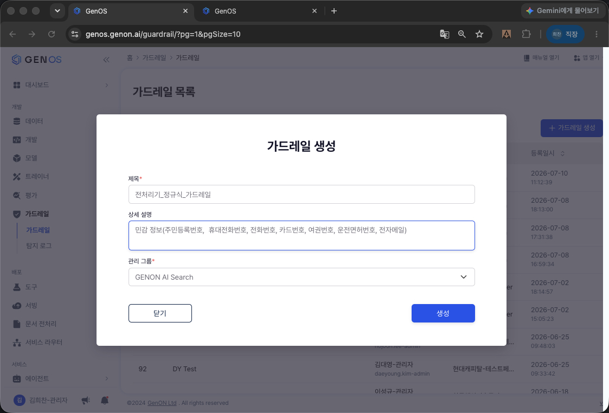

   생성 직후에는 필터 목록이 비어 있습니다. "필터 추가" 를 누릅니다.

   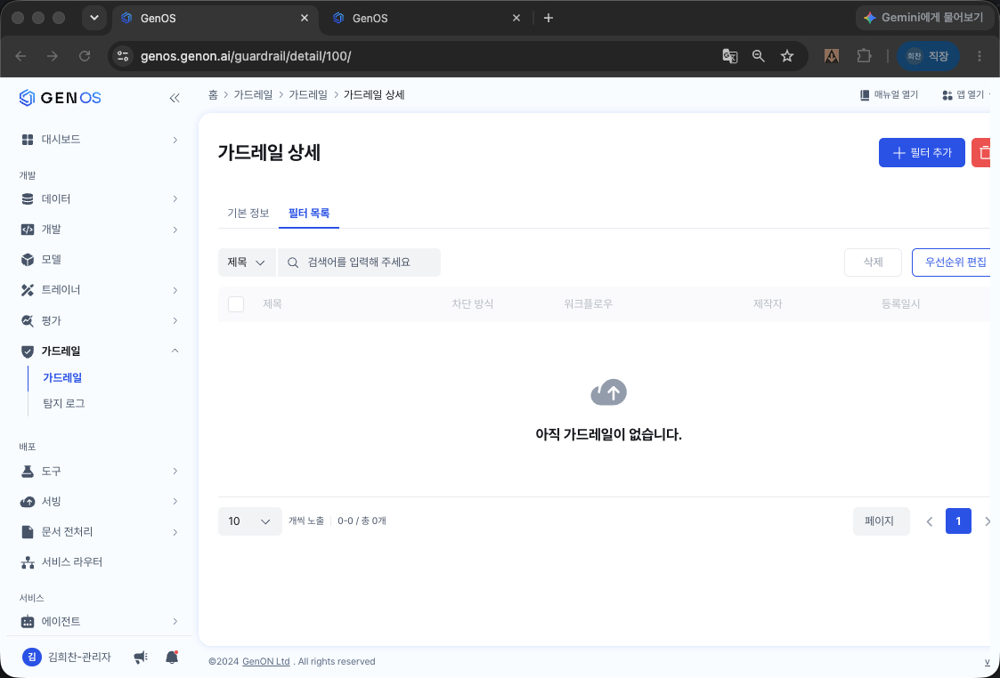

   필터 입력 — 제목, 차단 방식 **정규식**, 정규식 본문, 응답 방식 **"마스킹 처리하여 제공"** +
   치환 규칙(`[주민등록번호]`)을 넣습니다.

   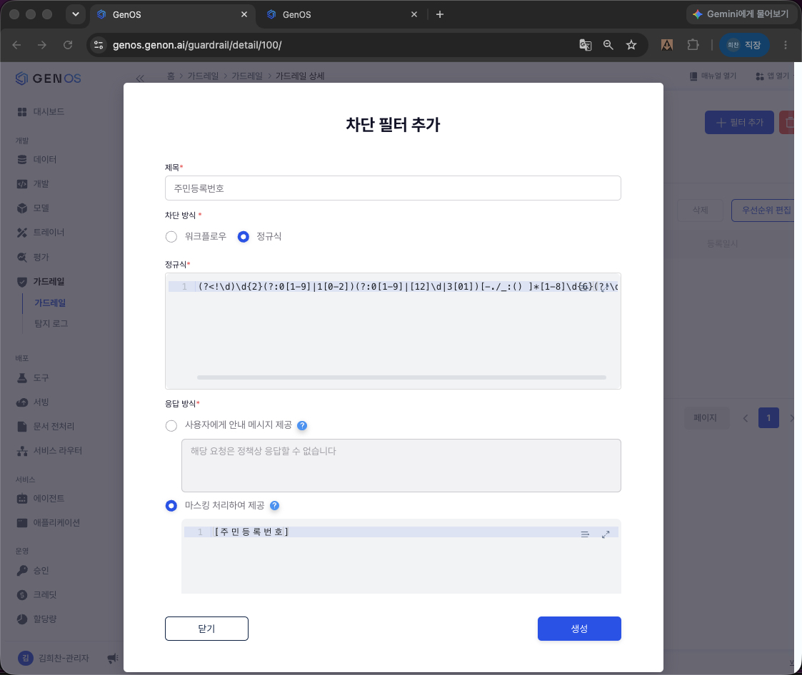

   같은 방식으로 필터들을 등록하면 아래처럼 목록이 채워집니다.

   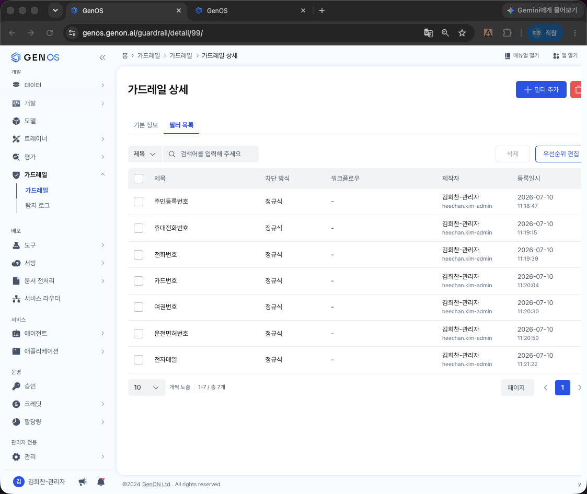

2. **모델서빙 확인** — 의미분류 LLM(예: 모델 776 qwen)의 호출 URL/키를 확인합니다.
   나중에 GPT OSS 120B 등으로 교체하려면 `GUARDRAIL_LLM_URL` 만 바꾸면 됩니다.

   좌측 메뉴 **서빙 → 모델 서빙** 을 누르면 서빙 중인 모델 목록이 나옵니다. 목록에서 사용할
   모델을 클릭해 **서빙 ID** 를 확인하고, 필요하면 인증키를 생성합니다.
   (인증키는 외부 주소로 호출할 경우에만 필요 — 내부 주소는 무인증, 4단계 표 참고)

   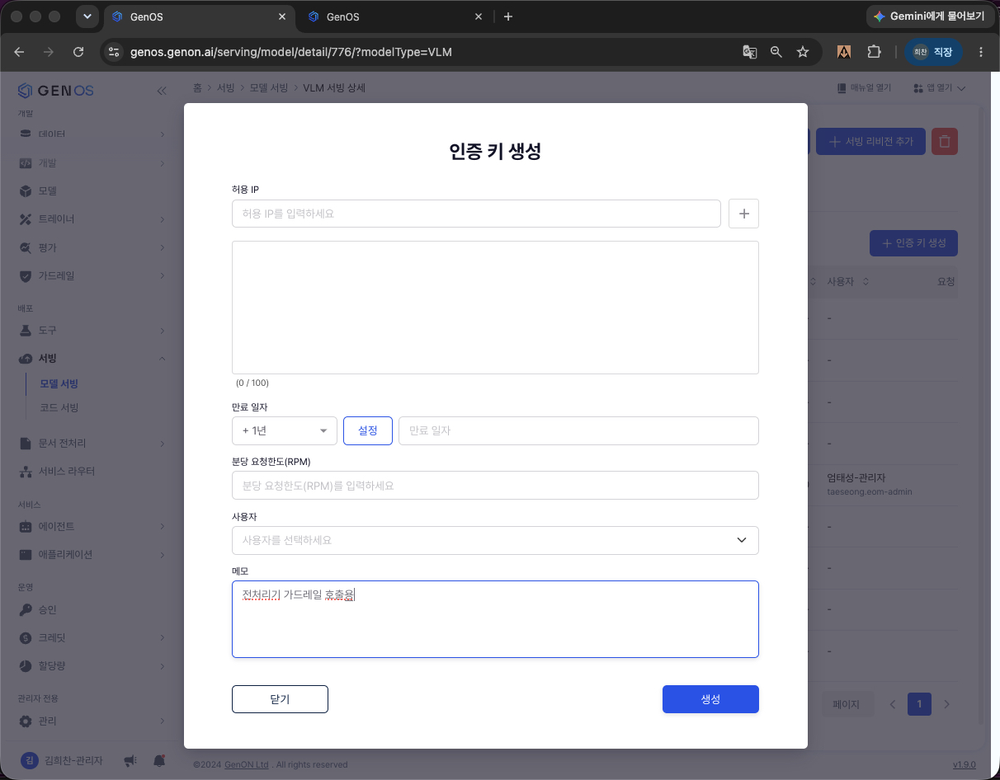

3. **워크플로우 생성** — GenOS 워크플로우에서 새 워크플로우를 만들고 **Python 단계** 에
   [`workflow_guardrail.py`](workflow_guardrail.py) 전체를 붙여 넣습니다.

   좌측 메뉴 **에이전트 → 워크플로우** 에서 새 워크플로우를 생성합니다.

   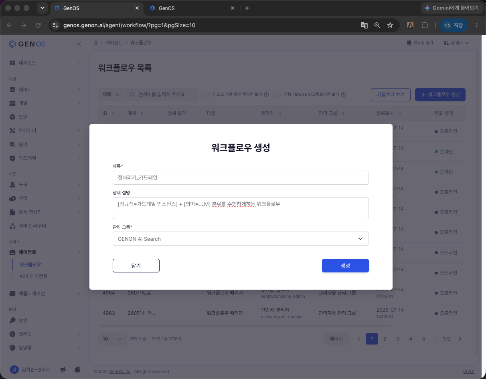

   생성하면 리비전 정보 화면으로 들어갑니다.

   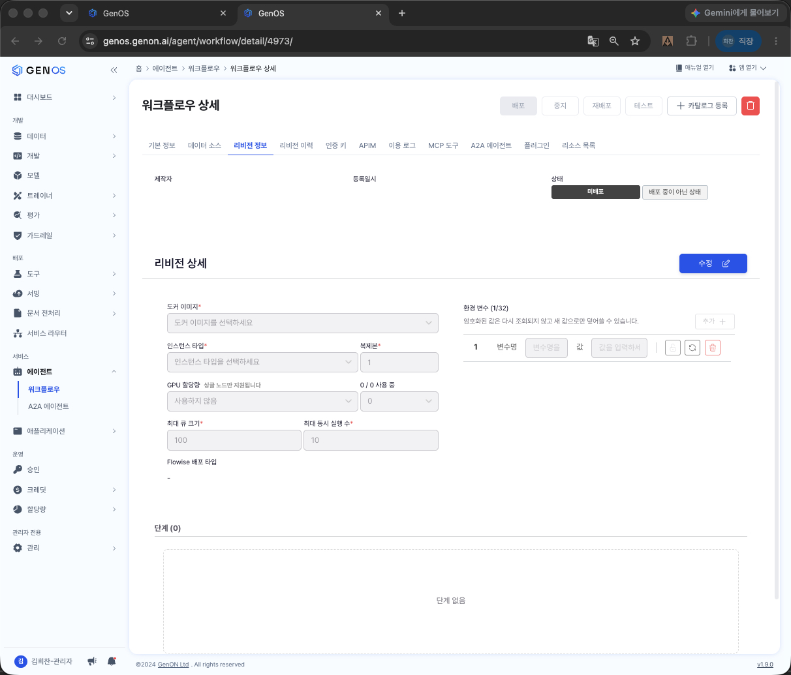

   리비전을 활성화합니다.

   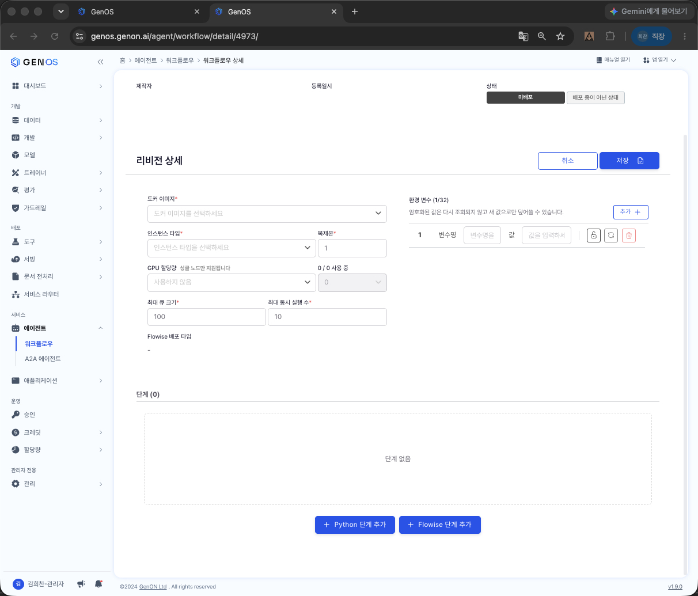

   캔버스에 **Python 단계** 를 추가합니다.

   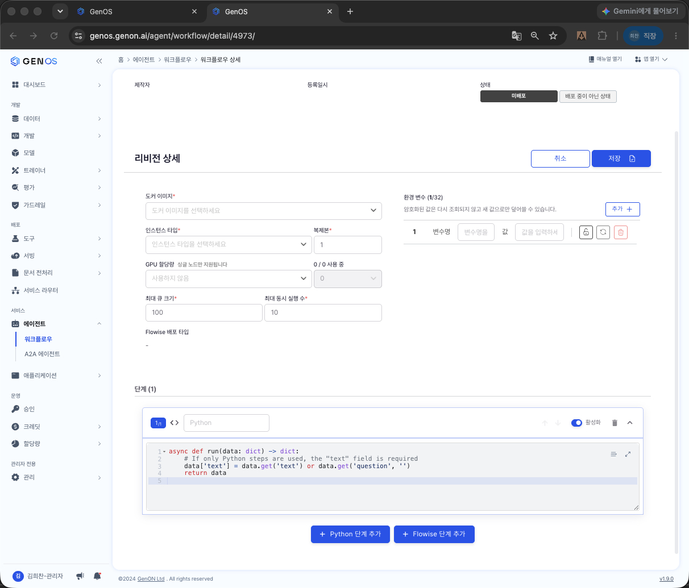

   코드 설정에 [`workflow_guardrail.py`](workflow_guardrail.py) 전체를 붙여 넣고 저장합니다.

   붙여 넣은 뒤, 아래 캡쳐의 **빨간 동그라미 두 곳** 을 본인 환경 값으로 맞춰야 합니다.
   - ① `GUARDRAIL_ID` 기본값 → **1단계에서 만든 가드레일 인스턴스 ID**
   - ② `_LLM_URL` 속 서빙 번호 → **2단계에서 확인한 LLM 서빙 ID**

   (코드를 고치는 대신 4단계의 환경 변수 `GUARDRAIL_ID` / `GUARDRAIL_LLM_URL` 로 지정해도 됩니다)

   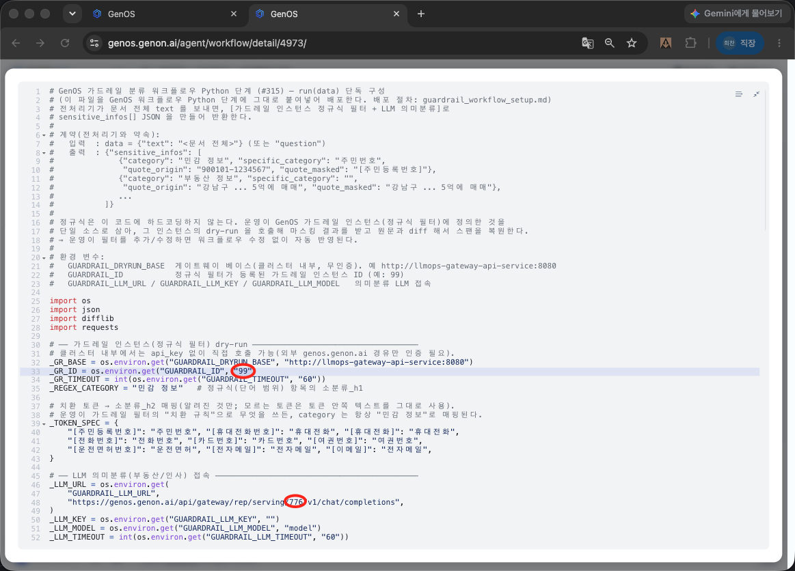

4. **환경 변수 설정 (필요 시)** — 아래 값들은 전부 코드에 default 가 있어, **표준 구성이면 env 를
   하나도 안 넣어도 동작합니다.** 구성이 다를 때만 해당 항목을 override 하세요.

   | env | default | 언제 바꾸나 |
   |---|---|---|
   | `GUARDRAIL_DRYRUN_BASE` | `http://llmops-gateway-api-service:8080` (내부 게이트웨이) | 게이트웨이 서비스명이 다른 사이트 |
   | `GUARDRAIL_ID` | `99` | 정규식 필터 인스턴스 ID 가 다를 때 |
   | `GUARDRAIL_LLM_URL` | `http://...:8080/rep/serving/776/v1/chat/completions` (내부) | 분류 LLM 서빙이 776 이 아닐 때 |
   | `GUARDRAIL_LLM_KEY` | (없음) | 내부 통신은 무인증이라 **불필요**. 외부 주소를 쓸 때만 설정 |
   | `GUARDRAIL_LLM_MODEL` | `model` | 서빙 모델명이 다를 때 |

5. **배포** 후 `workflow_id` 를 확인합니다 — 워크플로우 목록의 **ID 컬럼** 값입니다
   (배포 상태가 "배포 완료" 인지도 함께 확인).

   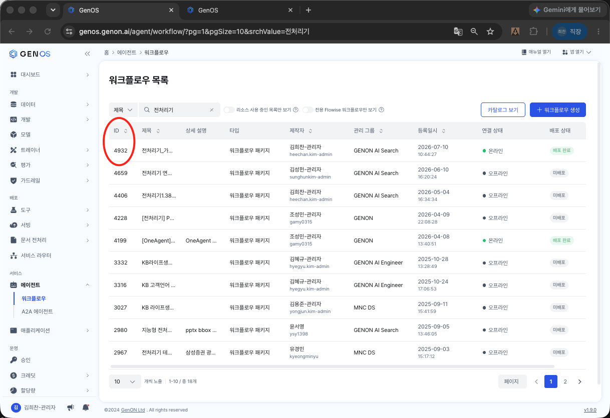

6. **인증키(AuthKeyBearer) 발급** — 워크플로우 실행 라우트(`/workflow/{id}/run`)는 Bearer 인증을
   요구합니다. 워크플로우 상세의 **"인증 키" 탭 → "+ 인증 키 생성"** 으로 발급하며,
   이 키가 전처리기 config 의 `api_key` 로 들어갑니다.

   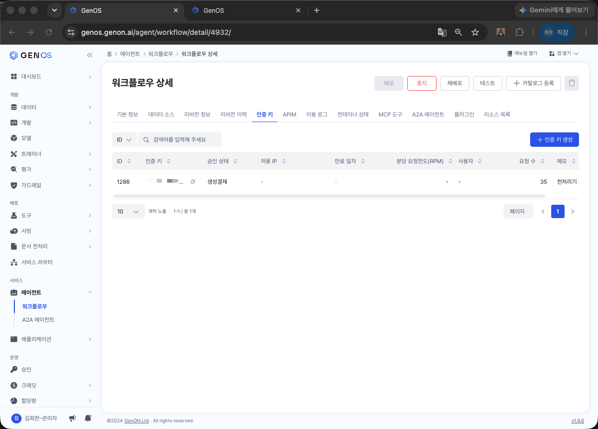

7. **전처리기와 연결** — 배포로 얻은 `url`(gateway 베이스)/`workflow_id`/`api_key` 3개를 전처리기
   config 의 `guardrail:` 섹션(1.3절)에 넣습니다.

### 배포 검증

```bash
# 헬스체크
curl -s "https://genos.genon.ai/api/gateway/workflow/{workflow_id}/healthcheck" \
  -H "Authorization: Bearer {api_key}"

# 실행 (run/v2) — 전처리기가 실제로 쓰는 경로/형식
curl -s -X POST "https://genos.genon.ai/api/gateway/workflow/{workflow_id}/run/v2" \
  -H "Authorization: Bearer {api_key}" -H "Content-Type: application/json" \
  -d '{"question": "홍길동 900101-1234567 서울 강남구 아파트를 5억에 매매"}'
# → data.sensitive_infos 에 주민번호(치환토큰) + 부동산 정보(라벨) 가 오면 정상
```

---

## 5. 자주 겪는 문제

| 증상 | 원인 / 조치 |
|---|---|
| 배포 시 `09050003` (응답에 text/json 없음) | Python 단계 dict 반환에 `text` 키 누락 → 스텝 코드처럼 `text` 도 함께 반환 |
| 워크플로우 직접 호출 401 | admin 토큰이 아니라 **워크플로우 AuthKeyBearer** 필요. config `api_key` 확인 |
| 라벨이 하나도 안 붙음 | 요청에 `guardrail_call: true` 를 안 넣음(기본 off) / `category` 가 비어 옴 / `quote_origin` 이 원문과 불일치(프롬프트가 변형) |
| 정규식류(주민번호·전화 등)가 안 잡힘 | 워크플로우가 가드레일 인스턴스 dry-run 을 못 부름 → `GUARDRAIL_DRYRUN_BASE`(내부 게이트웨이)·`GUARDRAIL_ID` 확인, 인스턴스에 정규식 필터 등록됐는지 확인 |
| 정규식은 잡히나 소분류가 토큰 그대로 | 가드레일 필터 "치환 규칙" 이 `[주민등록번호]` 같은 표준 토큰이 아님 → 토큰 표준화 or 매핑 테이블(`_TOKEN_SPEC`) 보강 |
| 마스킹이 안 됨 | `masking_enabled: false` 이거나 요청 `guardrail_call` off. 둘 다 on 이어야 치환 |
| 호출 자체가 안 감 | config `url`/`workflow_id`/`api_key` 중 빈 값 → 전처리기가 fail-open(원문 통과 + warning 로그) |
