# GenOS v2 Doc Parser 설치 및 Facade 구성 매뉴얼

이 문서는 **GenOS가 설치 완료된 사이트**에 Doc Parser 전처리기를 처음 설치·구성하는 사람을 위한 매뉴얼입니다. <br> 메뉴얼의 지시사항을 순서대로 이행하면, 마지막에는 사이트 GenOS의 챗봇이나 RAG에서 Doc Parser가 정상 동작하는 상태가 되도록 만드는 것이 목표입니다.

YAML 옵션 하나하나의 의미를 설명하는 reference 가 아니라, <br> **"무엇을 어디서 가져와서, 어떻게 등록·배포하고, 결과를 어떻게 확인하는가"** 의 흐름을 따라가는 작업 매뉴얼입니다. 

각 옵션의 의미·튜닝 기준이 궁금하면 [전처리기 소개](intro.md) 와 [intelligent_processor](intelligent_processor.md) 등의 reference 문서를, <br>
전체적인 전처리기에 대한 소개(목적, 첨부용/지능형 전처리기 차이 등)가 궁금하면 [20260618_전처리기교육](https://docs.google.com/presentation/d/1Jv2AYyOOAkDRppq8lni-JkJb0XF4xEpK/edit?usp=sharing&ouid=113104694679155634630&rtpof=true&sd=true) 문서를 참고해주세요.

---

## 1. 사전 조건과 전체 흐름

### 1.1 사전 조건

이 매뉴얼은 아래가 **이미 갖춰진 사이트**를 가정합니다.

- GenOS가 사이트에 설치·동작 중이고, 웹 UI상으로 접근 가능.
- Doc Parser가 호출할 모델 서빙 중 일부가 GenOS에 이미 등록·서빙 중. 구체적으로:
  - **Enrichment LLM 서빙** — TOC 생성·메타데이터 추출·이미지 설명에 공통으로 사용.
  - **임베딩 모델 서빙** (예: bge-m3) — 벡터 DB가 호출.
  - (**Layout 모델 서빙(dots.ocr vllm)** 과 **PaddleOCR** 은 위 가정에서 제외. 해당 이미지들은 사내 운영계 레지스트리에 올라가 있지 않으므로, 본 매뉴얼 2.2를 통해 엔지니어가 직접 빌드한 이미지를 사이트로 운반해 등록합니다.)

> 위 서빙들 중 빠진 게 있으면, 먼저 사이트에서 GenOS를 설치 완료후 해당 서빙 등록 부탁드립니다. <br> 등록된 서빙들의 **ID**(GenOS 웹 UI 모델 서빙 목록에 표시되는 숫자)가 본 매뉴얼 5단계의 YAML에 기재되어야 합니다.

### 1.2 전체 흐름

```
[2] 준비물 가져오기                                                 [3]~[7] GenOS 웹 UI에서 등록·배포
─────────────────────────────────────────────────────────   ─────────────────────────────────────────
① Doc Parser 이미지 (사내 GenOS 운영계에서 빌드 이미지 사전 다운 후, 
                   해당 이미지를 사이트에서 레지스트리/DB 등록)         
② PaddleOCR + dots.ocr vllm 서빙                                   ③ 전처리기 생성 (facade 코드 & YAML 붙여넣기)
   (엔지니어가 직접 빌드한 이미지를 사이트로 운반 → GenOS 등록)                ④ YAML 수정 후 리소스 파일로 첨부
③ 모델 서빙 ID 확인                                                  ⑤ 전처리기 배포 (이미지/인스턴스 지정)
                                                                  ⑥ 벡터 DB 생성 + 문서 추가로 동작 확인
                                                                  ⑦ 로그로 결과·오류 확인
```

각 단계는 다음 절부터 차례대로 다룹니다.

---

## 2. 준비물 가져오기

GenOS 웹 UI에서 등록을 시작하기 전에 사이트에 가져와야 할 게 세 가지 있습니다.

### 2.1 Doc Parser 컨테이너 이미지

**엔지니어들은 사이트에서 Doc Parser 이미지를 직접 빌드하지 않고,** 사내 GenOS 도커 레지스트리에 이미 빌드되어 올라와 있는 이미지를 받아 사이트로 운반합니다.

> **예외 — rhwp / LibreOffice 를 빼야 하는 사이트:** 사이트 정책상 `rhwp` · `LibreOffice` 패키지를 이미지에 넣을 수 없는 경우(예: 한국은행)에는, **운영계에 올라온 이미지를 그대로 쓸 수 없고 전처리기 이미지를 새로 빌드해야 합니다** (운영 이미지에는 두 패키지가 포함돼 있음). 빌드 시 `INSTALL_LIBREOFFICE=false` / `INSTALL_RHWP=false` 로 끄고 빌드하며, 절차는 [`genon/README.md` "A-2. (선택) rhwp / LibreOffice 제외 빌드"](../../../README.md#a-2-선택-rhwp--libreoffice-제외-빌드-이슈-286) 를 참고하세요. <br> 이렇게 빌드한 이미지에는 타 확장자(HWP·docx·ppt 등) → PDF 변환 로직이 없습니다. 영향은 전처리기 종류에 따라 다릅니다. <br> · **적재형(지능형)** — PDF 가 아닌 입력을 내부적으로 PDF 로 변환한 뒤 파싱하므로, 변환기가 없으면 HWP·docx·ppt 등 **PDF 가 아닌 문서는 처리하지 못합니다**(명확한 안내 메시지와 함께 실패). 따라서 이 사이트에서는 **이미 PDF 로 변환된 문서를 업로드**해야 합니다. <br> · **첨부형 / 변환형 / 파싱형** — HWP·HWPX 는 이미지에 항상 포함되는 **HWP SDK** 로, docx·ppt 는 원본을 직접 파싱하므로 변환 backend 없이도 동작합니다(영향이 적음). 다만 변환형(`convert_processor`)의 PDF 표준화 산출물 등 일부 부가 기능은 제한됩니다.

- 이미지는 `BUILD_VARIANT` (`standard` / `synap`) × `HW_VARIANT` (`cpu` / `gpu`) 의 조합으로 **4가지 태그**가 있습니다.

  | 조합 | 태그 예시 (`IMAGE_VERSION=2.2.0` 기준) |
  |---|---|
  | `cpu` + `standard` (기본) | `:2.2.0` |
  | `gpu` + `standard` | `:2.2.0-gpu-standard` |
  | `cpu` + `synap` | `:2.2.0-cpu-synap` |
  | `gpu` + `synap` | `:2.2.0-gpu-synap` |

  > 기본 조합(`cpu`+`standard`)만 접미사 없이 `:${IMAGE_VERSION}` 으로 떨어집니다. <br> 그 외 조합은 `:${IMAGE_VERSION}-${HW_VARIANT}-${BUILD_VARIANT}` 형태.

- 사이트별로 어떤 조합을 받을지는 두 축으로 결정합니다.
  - **`cpu` vs `gpu`** — 문서 파싱 모델을 어떻게 실행할지에 따라 갈립니다 (자세한 의미는 [4.3](#43-문서-파싱-모델-실행-방식-선택) 참고).
    - `genos_layout` 방식 (기본) 
      - Layout 검출·표 구조 추출 등 **무거운 딥러닝 파싱**을 외부 GenOS vLLM에 서빙된 **dots.ocr 한 모델**에 API로 위임. 
      - 전처리기 컨테이너 자체는 추론을 안 돌리므로 → **`cpu`**
    - `docling_layout` 방식 
      - Layout 모델과 TableFormer 등 **딥러닝 모델**을 **컨테이너 안에서 직접 실행** → **`gpu` 필수**
  - **`standard` vs `synap`** — 유료 PDF SDK(Synap) 라이선스를 보유한 사이트만 `synap`, 그 외는 모두 `standard`. 
    - **`synap` 이미지는 AI Search 팀이 별도로 전달**하므로, 사용시 직접 Search팀에 요청을 해야합니다.
- 사내 운영계 서버에서 받아 사이트로 운반:

```bash
# 사내 운영계 서버에서의 이미지 pull 및 압축 진행, 해당 tar을 사이트로 운반함
docker pull mncregistry:30500/mnc/doc-parser-preprocessor:2.2.0
docker save mncregistry:30500/mnc/doc-parser-preprocessor:2.2.0 \
  | gzip > doc-parser-preprocessor-2.2.0.tar.gz

# 사이트에서의 GenOS 서버에 해당 tar 업로드 후, 아래 명령어 실행.
gunzip -c doc-parser-preprocessor-2.2.0.tar.gz | docker load
```

- 사이트 GenOS 레지스트리·DB에 등록은 [`genon/preprocessor/scripts/register_image.sh`](../../scripts/register_image.sh) 로 처리합니다. 
  - 동일 디렉토리의 `register.config` 에 받아온 이미지와 같은 `IMAGE_VERSION` / `BUILD_VARIANT` / `HW_VARIANT` 를 입력한 뒤 실행하세요.
  - 단계별 상세 절차(레지스트리 push·DB 등록, 폐쇄망 사이트에서 `docker save → load → register_image.sh` 운반 흐름)는 [`genon/README.md` "C. 레지스트리 등록 (6~7번)"](../../../README.md#c-레지스트리-등록-67번) 과 [`"D. 사이트 배포 (8번)"`](../../../README.md#d-사이트-배포-8번) 참고.
- 빌드 정책·variant 의미·태그 규칙 등 빌드 측 상세는 [`genon/README.md` "전처리기 빌드 및 등록"](../../../README.md) 참고.

### 2.2 PaddleOCR · dots.ocr vllm 서빙 (직접 빌드 후 사이트 운반)

OCR 엔진(Paddle)과 Layout 모델 서빙(dots.ocr vllm)은 **사내 운영계 도커 레지스트리에 올라가지 않습니다**. 빌드 과정에서 HuggingFace·GitHub 등 외부 자원을 받아야 하기 때문에, 폐쇄망인 사이트에서 빌드하는 건 일반적으로 안 됩니다.

대신, **엔지니어가 외부 자원에 접근 가능한 환경에서 이미지를 직접 빌드한 뒤, 결과 이미지를 사이트로 직접 운반**해 GenOS에 등록하는 방식으로 진행합니다. (Doc Parser 본체의 2.1 은 "사내 운영계 레지스트리 pull → 사이트 운반" 이고, 이쪽은 "직접 빌드 → 사이트 운반" 이라는 차이.)

**PaddleOCR**

- 빌드/배포 가이드: [`genon/README.md#paddle-ocr-빌드-및-배포`](../../../README.md#paddle-ocr-빌드-및-배포)
- 빌드 후 PaddleOCR 서버가 클러스터 내부에서 접근 가능한 주소(예: `http://paddle-ocr-service:8080/ocr` 형태)를 메모해 두세요. <br> 5단계 YAML 의 `ocr.paddle.ocr_endpoint` 에 해당 주소를 입력해야 합니다.

**dots.ocr vllm 서빙 (Layout 모델)**

- 모델 다운로드 + vllm 서빙 명령어 옵션 안내: [`genon/README.md#dots-mocr-vllm-서빙`](../../../README.md#dots-mocr-vllm-서빙)
- GenOS 모델서빙으로 등록하는 일반 절차(vllm 사용): [Multi-Modal Serving 가이드 (GitBook)](https://genos-docs.gitbook.io/default/advanced-tutorials/guides/serving/multi-modal-serving)
- 위 안내를 따라 빌드·실행한 vllm 서버를 GenOS 모델서빙으로 등록한 뒤, 그 **서빙 ID**를 메모해 두세요. 다음 2.3 절의 `<LAYOUT_SERVING_ID>` 자리에 들어갑니다.

### 2.3 모델 서빙 ID 확인

GenOS 웹 UI에서 **관리 > 서빙 > 모델 서빙 목록**으로 들어가, 사용할 서빙들의 ID를 메모해 둡니다 (5단계 YAML에 기재할 값).

- **Layout 서빙 ID** (dots.ocr) — 2.2 에서 빌드·등록한 vllm 서빙의 ID. yaml의 `<LAYOUT_SERVING_ID>` 자리에 들어갑니다.
- **Enrichment LLM 서빙 ID** — 사이트에 이미 등록되어 있는 enrichment용 LLM 서빙의 ID. TOC / 메타데이터 / 이미지 설명 생성에서 **모두 같은 ID를 공유**합니다. yaml의 `<ENRICHMENT_SERVING_ID>` 자리.


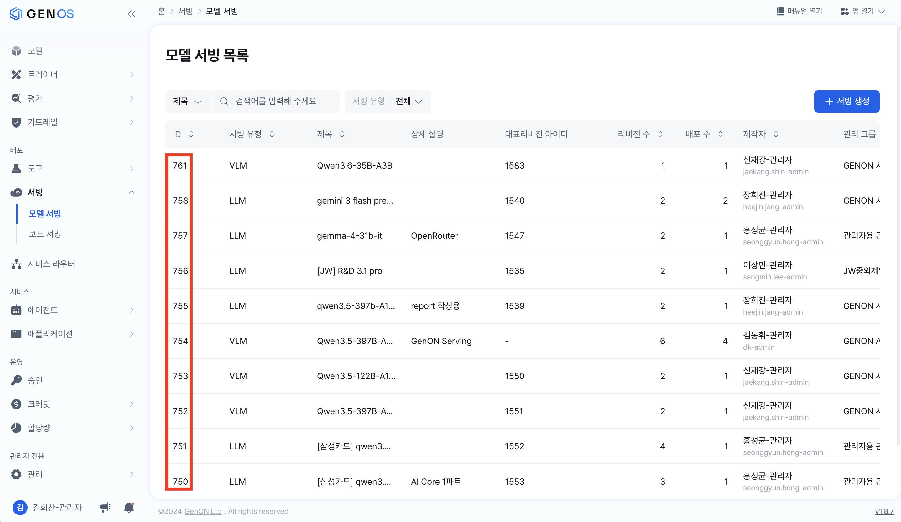

---

## 3. 전처리기 생성

GenOS 웹 UI에서 **관리 > 리소스 > 전처리기** 로 이동하여 **전처리기 생성** 버튼을 누릅니다.

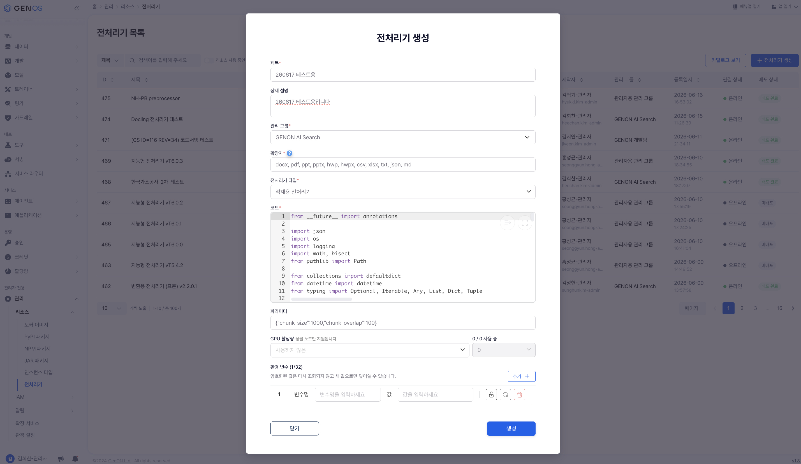

다음을 입력합니다.

| 필드 | 입력 값 |
|---|---|
| 전처리기 이름 | 사이트에서 쓸 이름 (예: `적재용 pdf`) |
| 상세 설명 | 자유 |
| 관리 그룹 | 사이트 운영 그룹 |
| 확장자 | 처리할 확장자 (예: docx, pdf, ppt, pptx, hwp, hwpx, csv, xlsx, txt, json, md) |
| 코드 | 용도에 맞는 facade 파일의 코드를 **그대로 복사·붙여넣기** |
| 파라미터 | kwargs 형태(JSON). 비워두거나 `{"chunk_size":1000,"chunk_overlap":100}` 등 |
| GPU 할당 | `docling_layout` 쓰는 경우만 1 이상. `genos_layout`(기본)이면 0 |

용도별 facade 파일 (모두 `genon/preprocessor/facade/`):

| 용도 | 파일 | 비고 |
|---|---|---|
| 첨부형 (채팅 첨부 실시간) | [`attachment_processor.py`](attachment_processor.md) | GPU 불필요 |
| 변환형 (첨부형 + PDF 표준화) | [`convert_processor.py`](convert_processor.md) | GPU 불필요 |
| 파싱형 (Element 구조화 API) | [`parser_processor.py`](parser_processor.md) | |
| 적재형 / 지능형 (RAG 적재) | [`intelligent_processor.py`](intelligent_processor.md) | Layout/Enrichment 사용 |

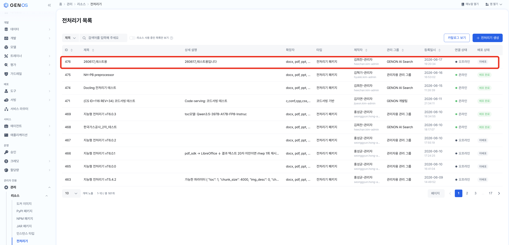

생성하면 전처리기 목록에 새 항목이 추가됩니다.

---

## 4. YAML 작성 (사이트 환경에 맞게 수정)

전처리기는 동작 시점에 **`parser_processor_config.yaml`**(또는 facade가 가리키는 yaml)을 읽어 OCR·Layout·Enrichment 호출 방식을 결정합니다. 이 yaml을 사이트 환경에 맞춰 수정한 뒤, 다음 절(5장)에서 전처리기 리소스 파일로 첨부합니다.

> YAML 각 값의 자세한 설정·튜닝 의미는 [20260618_전처리기교육](https://docs.google.com/presentation/d/1Jv2AYyOOAkDRppq8lni-JkJb0XF4xEpK/edit?usp=sharing&ouid=113104694679155634630&rtpof=true&sd=true) 문서의 다음 페이지를 참고하세요. <br>
> - **p.33** — YAML enrichment 값 관련 설정 설명
> - **p.35~39** — `custom_field` · `user_prompt` 관련 설명

### 4.1 시작점: 레포에 있는 yaml을 그대로 쓰면 안 되는 이유

레포의 **`resource_dev/`** 아래에 들어 있는 yaml(예: `resource_dev/intelligent_processor_config.yaml`)은 **사내망 로컬 PC에서 `python test.py` 로 facade 동작을 확인하는 dev 용도**로 세팅되어 있습니다. 사이트에 그대로 가져가면 동작하지 않습니다. 두 가지가 다릅니다.

| 항목 | dev yaml (`resource_dev/`) — 사내망 로컬 PC | 사이트 GenOS 배포용 |
|---|---|---|
| URL 형태 | 외부 게이트웨이: `https://genos.genon.ai/api/gateway/rep/serving/<ID>/...` | 사이트 k8s 내부 서비스 DNS: `http://llmops-gateway-api-service:8080/rep/serving/<ID>/v1/chat/completions` |
| `api_key` | 외부 호출이라 인증 필요 → 값이 채워져 있음 | k8s 내부 통신이라 불필요 → **빈 값** |
| `<ID>` | 사내 GenOS 환경의 서빙 ID | **사이트** GenOS에 등록된 서빙 ID (2.3에서 확인한 값) |

따라서 사이트 적용 시에는 dev yaml을 베이스로 시작하되, **URL을 사이트 k8s 내부 주소로 바꾸고, api_key는 비우고, `<ID>` 자리를 사이트의 실제 서빙 ID로 채워야 합니다.**

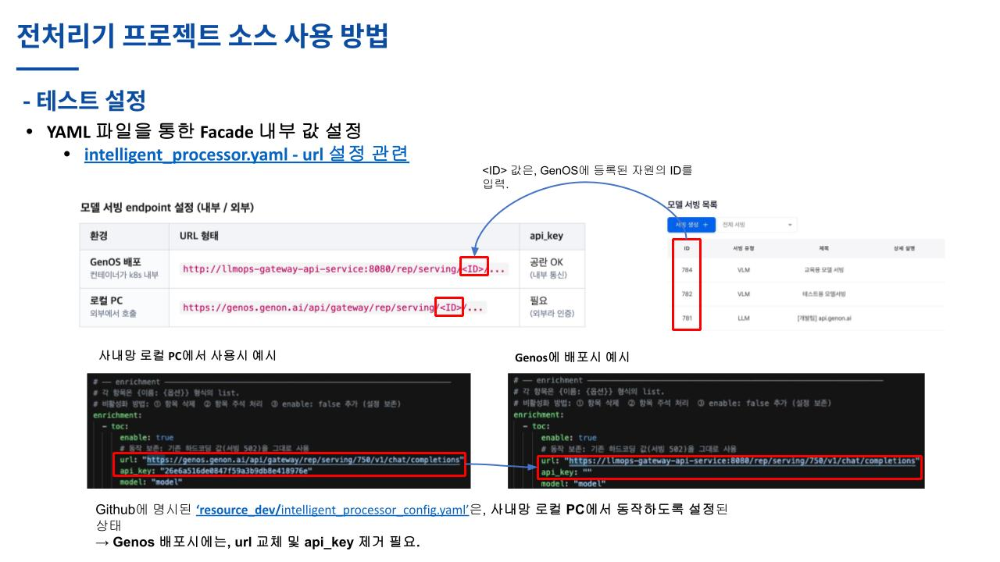

### 4.2 채워야 할 자리

dev yaml 안의 `<...>` 자리표는 다음과 같이 채웁니다.

- **`<LAYOUT_SERVING_ID>`** → 2.3 에서 메모한 dots.ocr 서빙 ID
- **`<ENRICHMENT_SERVING_ID>`** → 2.3 에서 메모한 LLM 서빙 ID. **`enrichment` 의 `toc` / `metadata` / `image_description` 세 항목 URL에 모두 동일한 ID를 사용합니다.** (이미지 설명용 별도 VLM이 등록된 사이트라도 토대 구조는 같음 — 운영 표준은 셋이 같은 서빙 ID 공유)
- **`<OCR_ENDPOINT>`** → 2.2 에서 빌드·배포한 사이트 PaddleOCR 서버의 클러스터 내부 접근 주소

기타 옵션(`ocr_mode`, `layout.genos_layout.page_batch_size`, enrichment 프롬프트 파일 등)은 기본값을 그대로 두면 됩니다. 사이트별로 튜닝이 필요한 항목과 그 의미는 [intelligent_processor.md](intelligent_processor.md) 와 [parser_processor.md](parser_processor.md) 참고.

> **자동 경고** — facade 는 yaml 로드 직후 미치환 플레이스홀더(`<UPPER_SNAKE>` 패턴, 예: `<LAYOUT_SERVING_ID>` / `<OCR_ENDPOINT>`)가 남아 있는지 탐지해 컨테이너 로그에 경고를 남깁니다 (`[DocumentProcessor] 미치환 설정 플레이스홀더가 발견되었습니다 ...`). 배포 직후 8장 로그에서 이 경고가 보이면 자리표 누락 → yaml 수정 후 재업로드·재배포 하세요.

### 4.3 문서 파싱 모델 선택

Doc Parser는 PDF 파싱에 쓰는 모델을 **두 가지 방식** 중 하나로 운영합니다. 핵심 차이는 "Layout 검출 / 표 구조 추출 같은 **무거운 딥러닝 파싱**을 **외부 통합 모델 API로 위임**할지(`genos_layout`), **컨테이너 안의 docling 내장 딥러닝 모델로 직접 실행**할지(`docling_layout`)"입니다. **CPU/GPU 이미지 선택은 그 결과**일 뿐, 자체가 방식의 정의는 아닙니다.

- **`genos_layout` (dots.ocr) — 기본/원칙**
  - **Layout 검출**과 **표 구조 추출**을 GenOS vLLM에 서빙된 **dots.ocr** 모델 하나에 **API로 호출**해 받아옵니다 (Doc Parser는 결과만 받아서 씁니다). 
  - **Layout간 읽기 순서**도 **dots.ocr** 출력 순서를 그대로 보존해 별도 처리 없이 사용합니다.
  - 컨테이너에서 무거운 추론을 안 돌리므로 **CPU 이미지(`:${IMAGE_VERSION}`)로 충분**합니다.
  - yaml 기본값이 이 값으로 설정되어 있어서, 별도 수정이 필요 없습니다.

- **`docling_layout` (구버전 docling 내장 모델 세트)**
  - 구버전 docling에 내장된 GenOS fine-tuned **Layout 모델 + TableFormer** 같은 **딥러닝 모델**을 **컨테이너 안에서 직접 실행**합니다 (API 호출 아님). 
    - **GPU가 필수**인 이유는 위 Layout/Table 딥러닝 모델 때문입니다 
  - **읽기 순서**(`ReadingOrderModel`)는 이 방식에서도 **알고리즘(rule-based) 기반**이라 GPU 부담과는 무관합니다.
  - 2.1에서 받은 이미지가 `-gpu-standard`(또는 `-gpu-synap`) 여야 하고, 6단계 전처리기 배포 시 GPU 인스턴스를 지정해야 합니다.
  - yaml에서 다음 한 줄을 바꿉니다:
    ```yaml
    layout:
      layout_model_type: "docling_layout"   # 생략 시 기본값 genos_layout
    ```

> 정리하면, **이미지 태그 선택의 근거는 "어떤 문서 파싱 모델 방식을 쓸지"** 입니다. `genos_layout` 만 쓸 거면 CPU 이미지, `docling_layout` 도 쓸 사이트면 GPU 이미지.

---

## 5. YAML 및 프롬프트 파일 등록 (전처리기 리소스 파일로 첨부)

전처리기 목록에서 방금 만든 전처리기를 클릭해 상세 화면으로 들어갑니다. 상단 탭에서 **리소스 목록** 을 선택한 뒤 **업로드** 버튼으로 **다음 파일들을 한 묶음으로 올립니다**.

| 파일 | 역할 |
|---|---|
| `intelligent_processor_config.yaml` (4단계에서 수정한 것) | 메인 config — OCR / Layout / Enrichment 설정 |
| `prompt_toc_default_system.md` / `prompt_toc_default_user.md` | TOC 생성 enrichment 프롬프트 |
| `prompt_metadata_default_system.md` / `prompt_metadata_default_user.md` | 메타데이터 추출 enrichment 프롬프트 |
| `prompt_image_description_default.md` | 이미지 설명 enrichment 프롬프트 |

> 위 파일들은 운영 표준 묶음으로 레포의 [`genon/preprocessor/resource/`](../../resource/) 폴더에 한 세트로 들어 있습니다. **그 폴더 내용을 통째로 가져와서, yaml만 사이트에 맞게 수정한 뒤 같은 묶음을 그대로 업로드**하면 됩니다.

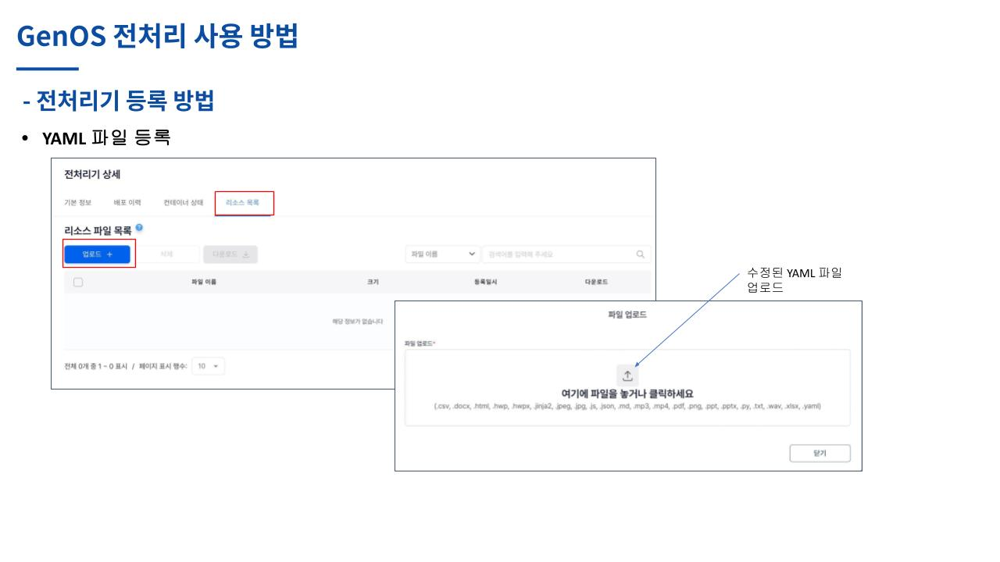

업로드된 파일들은 전처리기 컨테이너가 기동될 때 컨테이너 내부 `/app/resource` 로 자동 다운로드되어 facade 코드가 읽어갑니다. yaml의 enrichment 항목들이 `system_prompt_file: prompt_toc_default_system.md` 같은 키로 같은 폴더의 prompt 파일을 가리키므로, **yaml만 올리고 prompt md 파일들을 빼먹으면 enrichment 가 동작하지 않습니다.**

이후 수정이 필요하면 같은 화면에서 해당 파일을 다시 업로드해 교체합니다.

---

## 6. 전처리기 배포

전처리기 상세 화면 상단 탭의 **배포 이력** → 우측 **배포** 버튼으로 배포 다이얼로그를 엽니다.

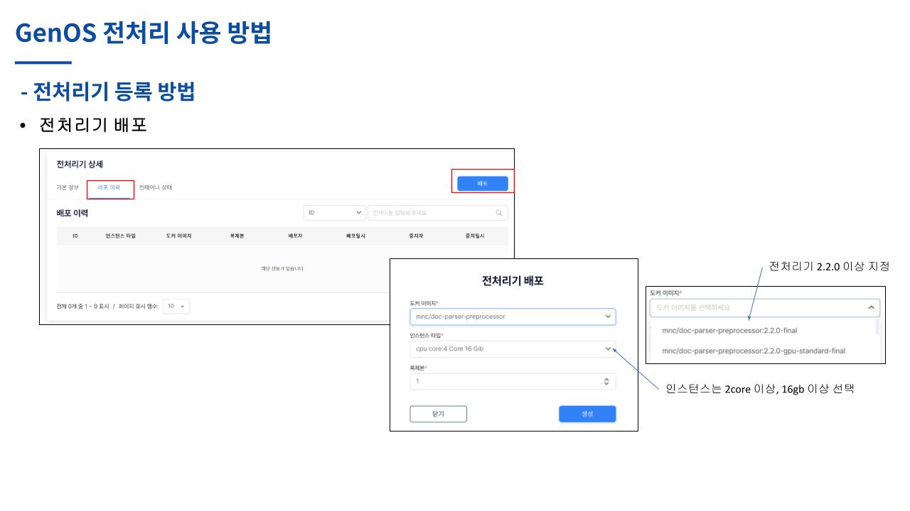

다이얼로그에서 다음을 지정합니다.

| 필드 | 입력 값 |
|---|---|
| 도커 이미지 | 2.1 에서 사이트에 등록한 Doc Parser 이미지 (예: `mnc/doc-parser-preprocessor:2.2.0-final`). <br> **전처리기 2.2.0 이상**의 태그를 선택하세요. `docling_layout` 방식을 쓴다면 `-gpu` 가 붙은 태그. |
| 인스턴스 타입 | **2 core / 16 GiB 이상**. `docling_layout` 방식이면 GPU 가 포함된 인스턴스. |
| 복제본 | 1 (사이트 트래픽에 따라 늘림) |

생성을 누르면 배포가 시작됩니다. **컨테이너 상태** 탭으로 이동해 진행을 확인합니다.

- 정상 흐름: `배포중` → `실행 준비 중` → `배포 완료`. 마지막에 초록색 `배포 완료` 가 보이면 성공.
- 문제 상황: `할당 대기 중` 상태로 멈추면 지정한 인스턴스 자원이 부족하다는 뜻 → 불필요한 자원 정리 or 더 작은 인스턴스 타입을 선택해 다시 배포.

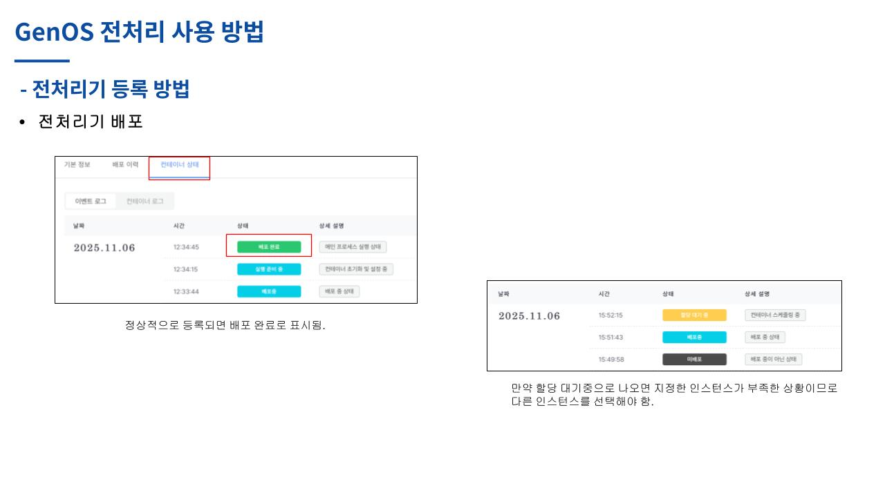

---

## 7. 벡터 DB 생성과 문서 추가 (동작 확인)

전처리기가 떴다고 끝이 아니라, **실제 문서를 넣어 RAG 적재까지 한 번 돌려봐야** 정상 동작을 확신할 수 있습니다.

### 7.1 벡터 DB 생성

GenOS 웹 UI에서 **데이터 > 벡터 DB > 벡터 DB 생성** 으로 새 벡터 DB를 만듭니다.

- 데이터 형식: **문서** (다른 옵션 — QA, 자동 적재, FAQ — 선택 금물)
- 제목/관리 그룹은 사이트 정책에 맞춰 입력

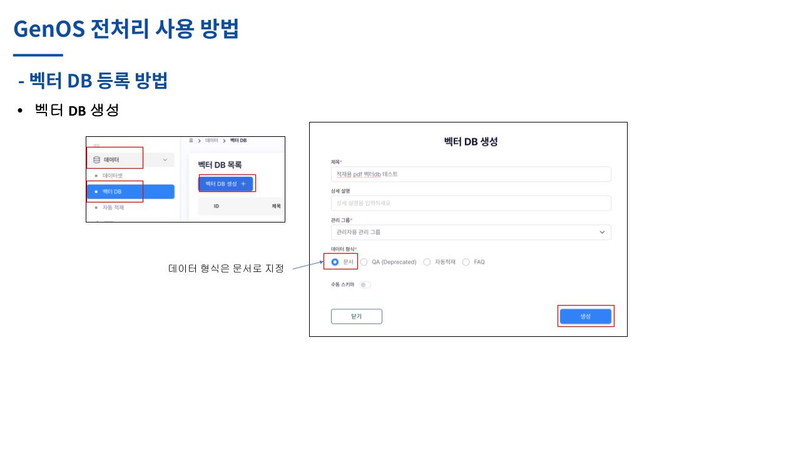

### 7.2 문서 추가

생성한 벡터 DB 상세의 **문서 목록** 탭에서 **업로드** 버튼을 누르면 2 단계 다이얼로그가 뜹니다.

**1단계:**
- 임베딩 서빙: 사이트에 등록된 임베딩 모델 (예: `bge-m3`) 선택
- 배치 크기: 기본값 유지 (예: 64)
- **문서 유형**: 3 단계에서 등록한 우리 전처리기를 선택 ← 가장 중요한 지점
- Chunk Size / Chunk Overlap / 상세 설명은 기본값 / 자유

**2단계:**
- 테스트할 PDF 등 파일을 1개 이상 드래그/선택 후 "생성"

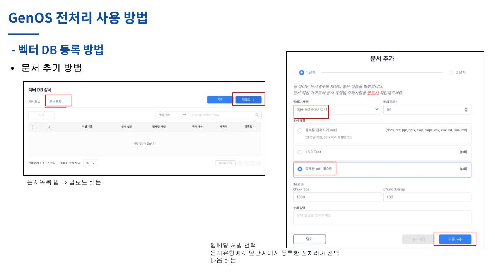

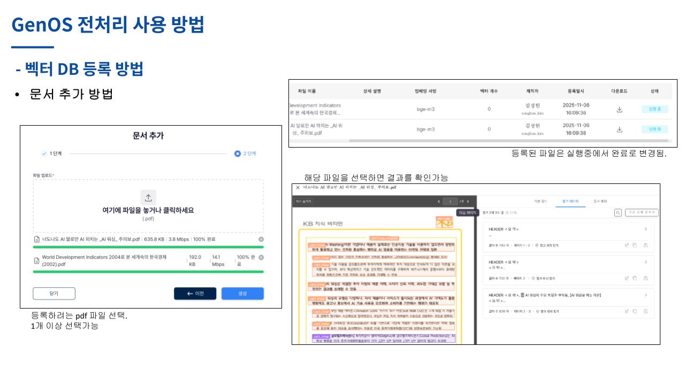

업로드된 파일은 처음엔 `실행 중` 상태이고, 잠시 후 `완료` 로 바뀝니다. 파일을 클릭하면 청크 결과·바운딩 박스·메타데이터를 시각적으로 확인할 수 있습니다.

> `실행 중` 이 너무 길거나 `오류 발생` 으로 바뀌면 8장 로그 확인으로 넘어가세요.

### 7.3 결과가 정상인지 점검

벡터 DB의 결과 보기에서 다음을 눈으로 확인합니다.

- 텍스트가 정상 추출되었는가? (누락/깨짐 없음)
- 청크 크기가 적절한가? 문맥이 유지되는가?
- 섹션 헤더가 청크 첫 줄(`HEADER: ...`)에 잘 태깅되었는가? (지능형 전처리기 한정)

이 점검에서 막히면 9장(사이트 최적화)로 가세요.

---

## 8. 오류 발생 시 로그 확인

문서 추가가 `오류 발생` 으로 끝나면 두 군데 로그를 봅니다.

### 8.1 GenOS 웹 UI 컨테이너 로그

해당 전처리기 상세 → **컨테이너 상태** 탭 → **컨테이너 로그** 를 선택하면 stdout 로그가 보입니다. `/run` 호출에 대한 `Start: "..."`, `Success: "..."`, `End: "... (NN.NN seconds)"` 라인과 에러 트레이스가 여기에 남습니다.

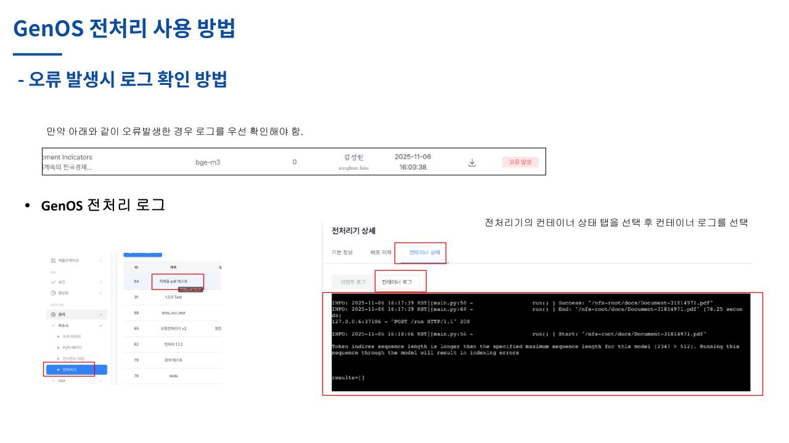

### 8.2 k9s 로그 (서버 직접 접근)

웹 UI 로그가 부족하면 클러스터에 직접 들어가 봅니다.

1. 사이트의 k8s 마스터에 SSH 접속
2. `k9s` 실행
3. `:deploy` 또는 `/pre` 로 필터 → 우리 전처리기 deploy 선택 (이름이 `preprocessor-<id>` 형태이며 `<id>` 는 GenOS 웹UI의 전처리기 ID와 동일)
4. 해당 Pod 선택 후 **`l`** (소문자 L) 키로 로그 진입

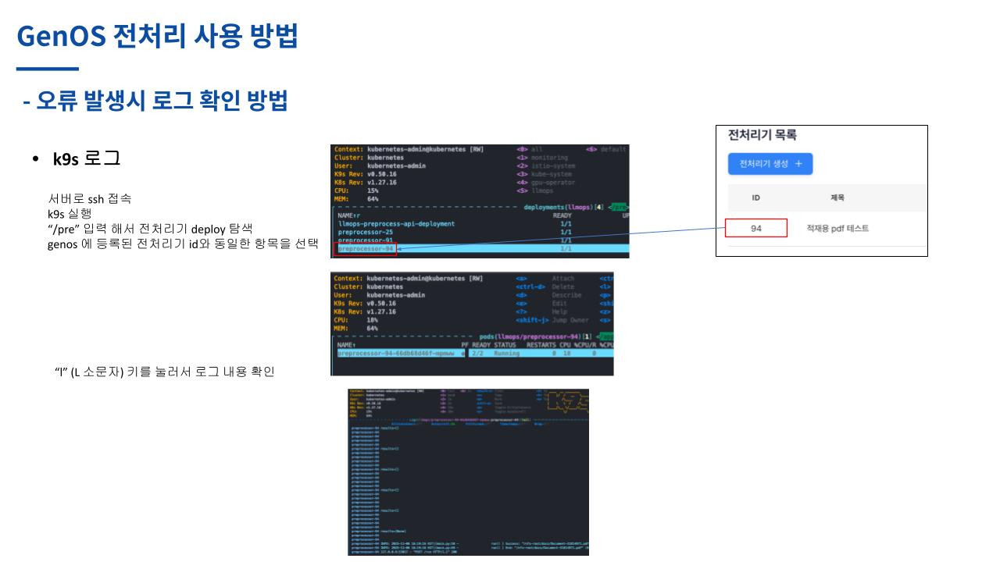

로그 레벨이 낮으면 yaml 의 `defaults.log_level` 을 `5` (DEBUG) 로 올리고 yaml 을 재업로드한 뒤 재배포해 더 자세한 로그를 받습니다.

---

## 9. 사이트 최적화 포인트 (참고)

전처리기가 한 번 정상 동작한 후에도, RAG 검색 품질 관점에서 사이트별로 손볼 부분이 있습니다.

### 9.1 점검 항목 (벡터 DB 결과 화면 기준)

- **텍스트가 잘 나오는가?** 누락·깨짐이 보이면 → 4단계 yaml 에서 `ocr.ocr_mode` 를 `force` 로 올리거나, `attachment_processor` 같이 OCR을 안 거치는 경우엔 OCR 포함 facade(`intelligent_processor.py`)로 교체.
- **청킹이 적절한가?** 청크가 너무 크거나 문맥이 끊기면, 손 댈 수 있는 범위가 facade 별로 다릅니다.
  - `attachment_processor.py` — 청커는 `attachment_processor_config.yaml` 의 [`defaults.chunker_type` (L9)](../../resource/attachment_processor_config.yaml#L9) 로 `recursive`(기본) ↔ `hybrid` 전환 가능합니다.
    - 청커별 세부 옵션은 같은 파일의 [`chunking.recursive` (L30-36)](../../resource/attachment_processor_config.yaml#L30-L36) (`chunk_size` / `chunk_overlap` / `token_chunk_size_cap`) 또는 [`chunking.hybrid` (L39-42)](../../resource/attachment_processor_config.yaml#L39-L42) (`max_tokens` / `merge_peers`) 에서 조정합니다.
    - 수정한 yaml 을 5단계 절차대로 리소스 파일로 재업로드한 뒤 전처리기를 재배포합니다.
  - `convert_processor.py` / `intelligent_processor.py` — 청커가 `GenosSmartChunker` 로 **고정**되어 yaml·kwargs 만으로는 바꿀 수 없습니다. 청크 품질이 큰 문제면 facade 코드의 청크 로직을 직접 손봐야 하므로 AI Search 팀에 문의하세요.

### 9.2 더 깊은 변경이 필요한 경우

Facade 코드 자체를 사이트에 맞게 수정해야 하는 케이스(새 확장자 처리, 지능형에서 청킹 알고리즘 변경 등)는 **facade 소스를 사이트 운영자가 직접 수정**해 다시 저장하면 됩니다. 안전한 수정 범위와 패턴은 facade reference 문서들을 참고하세요.

---

## 부록: 사내망 로컬 PC 테스트 흐름 (개발자용)

사이트 적용 전 사내망에서 facade 코드 변경을 검증하고 싶을 때 쓰는 흐름입니다. 사이트 운영 매뉴얼이 필요한 분은 건너뛰어도 됩니다.

```bash
git clone https://github.com/genonai/doc_parser.git
cd doc_parser
git checkout develop
cd ./genon/preprocessor/
uv sync
source ./.venv/bin/activate

cd ./facade
# test.py 안의 from <processor>_processor import DocumentProcessor 와
# file_path 만 원하는 값으로 수정 후 실행
python test.py
# 결과는 같은 디렉토리의 result.json 에 저장
```

- **genon 사내망 VPN 접속 필요** (dev yaml 의 외부 게이트웨이 호출 때문).
- 이 흐름은 `resource/...yaml`이 아닌 `resource_dev/...yaml` 을 그대로 사용합니다. 사이트 배포 시에는 4단계대로 yaml 을 수정해야 한다는 점만 잊지 마세요.

---

## 참고 문서

- 전처리기 개념 및 4종 facade 비교: [intro.md](intro.md)
- 각 facade 동작 상세: [attachment](attachment_processor.md) / [convert](convert_processor.md) / [parser](parser_processor.md) / [intelligent](intelligent_processor.md)
- 이미지 빌드·등록 측 상세: [`genon/README.md`](../../../README.md)