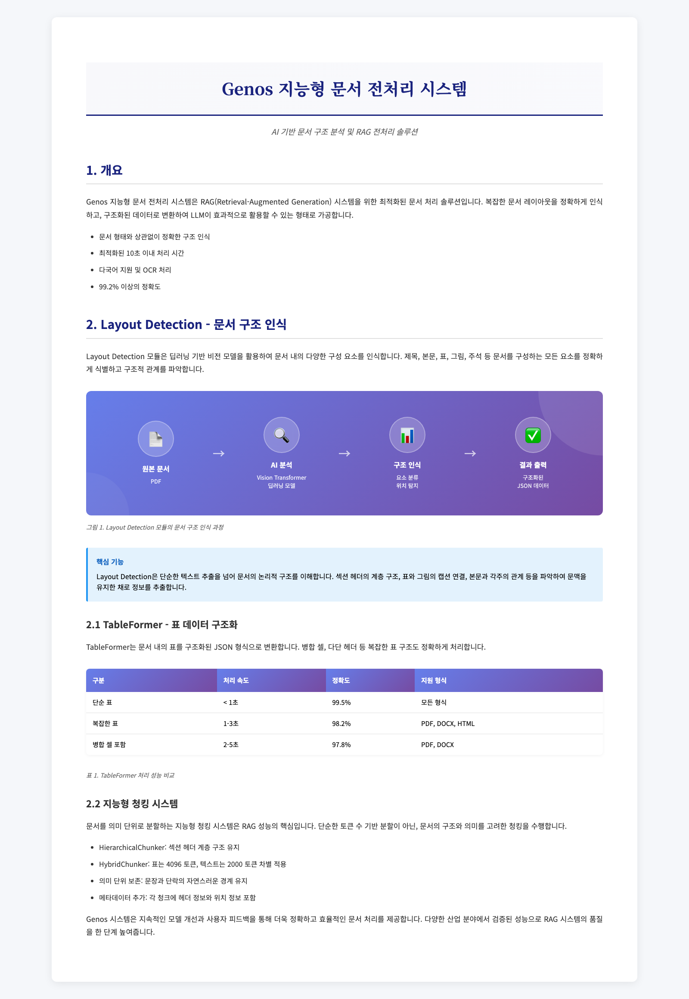
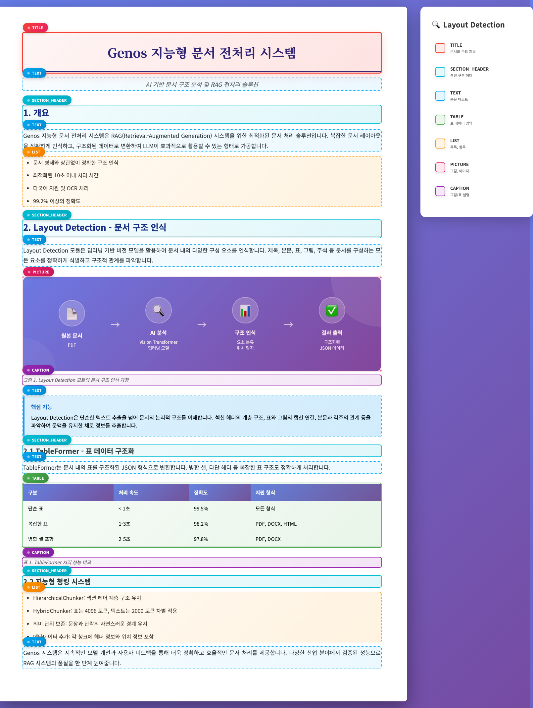
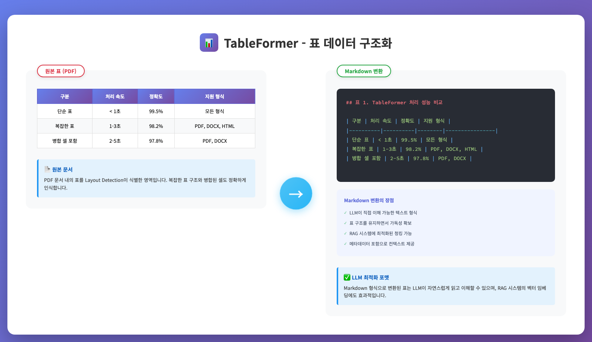

# Genos 전처리기 (Genos Doc Parser)
- Genos는 문서의 활용 목적과 요구 사항에 따라 최적화된 3가지 유형의 전처리 파이프라인을 제공합니다.
- 용법: genos 에서 새로운 facade 를 생성하고 아래 전처리 중 하나의 전처리기를 facade에 복붙하기만 하면 끝

## 1. 첨부용 전처리기 (Attachment Processor) 
사용자가 채팅 중 첨부로 업로드하는 파일을 실시간으로 분석하기 위한 경량화 전처리기입니다. 복잡한 구조 분석 과정을 생략하고, **텍스트 추출(Text Extraction)**에 집중하여 즉각적인 응답 속도를 보장합니다.

- **"속도 중심: 다양한 포맷의 텍스트 즉시 추출"**
- 설명: [attachment_processor.md](attachment_processor.md)
- 위치: [preprocessor/facade/attachment_processor.py](https://github.com/genonai/doc_parser/blob/develop/genon/preprocessor/facade/attachment_processor.py)
- 특징
  * **Native 텍스트 추출**: HWP, HWPX, DOCX, XLSX 등 원본 파일의 텍스트를 파싱하여 추출 속도 극대화
  * **멀티미디어 지원**: 오디오 파일(MP3, WAV, M4A)의 음성을 텍스트로 변환(STT)하여 처리
  * **데이터 변환**: CSV, Excel 등의 정형 데이터를 LLM이 이해하기 쉬운 텍스트/JSON 형태로 신속 변환

## 1A. 변환용 전처리기 (Convert Processor)
문서의 시각적 형태(Layout)를 유지해야 하거나, 텍스트 추출이 까다로운 레거시 포맷을 처리하기 위한 전처리기입니다. 모든 문서를 **PDF로 우선 변환(Rendering)**하여 포맷의 파편화를 해결합니다.
첨부용 전처리기 대용으로 쓸 수 있도록 고안된 첨부 전처리기의 변형 전처리기 입니다.

**"호환성 중심: PDF 표준화 후 텍스트 추출"**
- 설명: [convert_processor.md](convert_processor.md)
- 위치: [preprocessor/facade/convert_processor.py](https://github.com/genonai/doc_parser/blob/develop/genon/preprocessor/facade/convert_processor.py)
- 특징
  * **PDF 표준화**: LibreOffice 엔진을 활용하여 PPT, DOCX 등 다양한 문서를 PDF 포맷으로 통일
  * **시각적 정합성 유지**: 원본 문서의 폰트, 이미지 배치, 페이지 레이아웃을 그대로 보존
  * **하이브리드 추출**: 변환된 PDF 레이어에서 텍스트와 이미지 정보를 결합하여 안정적인 정보 획득

## 2. 적재용 지능형 전처리기 (Intelligent Processor)
RAG(검색 증강 생성) 시스템의 지식 베이스 구축을 위해 설계된 고성능 전처리기입니다. 단순 텍스트 추출을 넘어, **딥러닝 기반의 Layout 분석**을 통해 문서의 논리적 구조를 정확하게 파악합니다.

**"품질 중심: AI 기반 레이아웃 분석 및 고품질 데이터 적재"**
- 설명: [intelligent_processor.md](intelligent_processor.md)
- 위치: [preprocessor/facade/intelligent_processor.py](https://github.com/genonai/doc_parser/blob/develop/genon/preprocessor/facade/intelligent_processor.py)

### 왜 지능형 처리가 필요한가요?
복잡한 다단 구성, 표, 차트가 포함된 문서는 단순 추출 시 문맥이 파괴될 수 있습니다.

## 핵심 기술

#### 1) Layout Detection (문서 구조 인식)
딥러닝 모델이 문서의 시각적 요소를 분석하여 제목, 본문, 표, 그림, 캡션 등의 역할을 명확히 구분합니다.

*AI 모델이 문서의 각 요소를 식별하고 구조화하는 과정*

*AI 모델이 문서 요소를 자동 식별 (핵심 11종)
- 1. 구조 및 위계
  - Title: 문서 전체의 메인 제목
  - Section-header: 문서의 장, 절 제목 (Heading)
- 2. 본문 및 컨텐츠
  - Text: 일반적인 본문 문단 (Paragraph)
  - List-item: 글머리 기호나 번호가 붙은 리스트의 개별 항목
- 3. 복합 데이터
  - Picture: 사진, 삽화, 다이어그램 등 이미지 요소
  - Table: 표 데이터
  - Formula: 수학 공식 및 수식
  - Caption: 표, 그림, 수식에 대한 설명 문구
  - Footnote: 페이지 하단의 각주
- 4. 보조 데이터 (Layout 에는 표시되지만, 본문 Chunk 에는 제외됨)
  - Page-header: 페이지 상단 정보 (문서 제목, 장 정보 등)
  - Page-footer: 페이지 하단 정보 (페이지 번호 등)

Layout Detection은 딥러닝 비전 모델을 활용하여 문서의 시각적 구조를 분석합니다. 단순 텍스트 추출을 넘어 제목, 본문, 표, 그림, 캡션 등의 역할을 명확히 구분합니다.

#### 2) TableFormer (표 데이터 구조화)
단순히 텍스트만 긁어오는 것이 아니라, 병합된 셀이나 다중 헤더를 가진 복잡한 표를 분석하여 Markdown 및 HTML 형태로 완벽하게 복원합니다.

*복잡한 표가 구조화된 마크다운 데이터로 변환된 결과*

#### 3) 지능형 보정 및 연결
* **Smart OCR**: 문서 전체가 아닌, 인코딩 오류(GLYPH)가 감지된 영역만 선별적으로 OCR을 수행하여 정확도와 효율성 확보
* **Context Enrichment**: LLM을 통해 목차(TOC)를 생성하고, 본문 내 '별지/별표' 참조를 실제 부록 파일과 자동 연결하여 검색 품질 향상

#### 4) LLM을 활용한 문서 문맥 기반 Enrichment
* **구조화된 목차 생성**: LLM을 활용하여 문서의 논리적 흐름을 분석하여 문서에 명시적으로 없더라도 문서 전체의 Table of Contents 를 찾아내고 구성합니다.
  * "제1장 > 제1절 > 제1조" 형태의 계층적 목차(Table of Contents)를 생성
* **메타데이터 풍부화**: 문서에서 유추 할 수 있는 정보를 각 청크에 포함시켜, 검색 시 해당 내용이 문서의 어느 위치(Context)에 해당하는지 파악할 수 있게 합니다.
  * 문서의 생성일, 문서의 키워드, 문서의 요약 등
